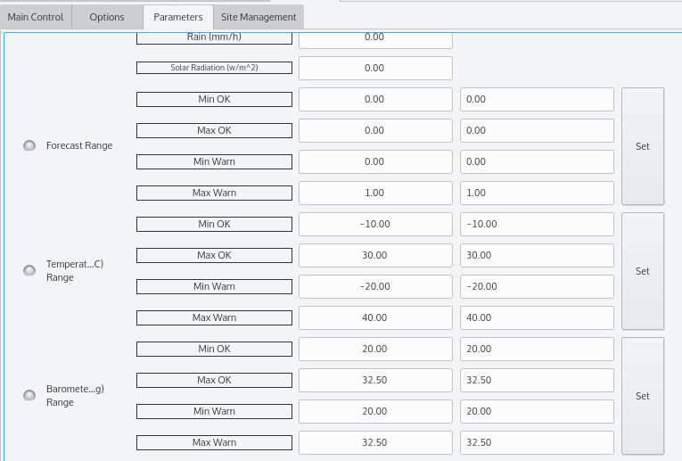
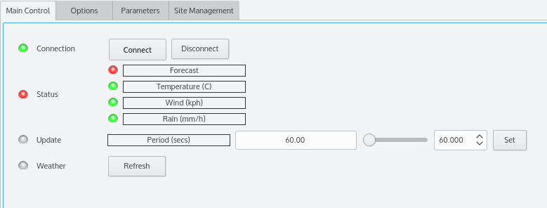

## Features

The driver supports all Davis Instruments line of Vantage weather stations that are connected using the  [USB Data Logger](http://www.davisnet.com/weather/products/weather_product.asp?pnum=06510USB)  connecter. The driver displays data for the following parameters in metric units:

-   **Weather**: Weather forecast (clear, cloudy, rainy...etc). 0 for Clear/Sunny, 1 for partly cloudy or light haze, 2 for everything else.
-   **Temperature (C)**: Inside temperature in Celcuis.
-   **Humidity (C)**: Relative Humidity %
-   **Barometer (millibars)**: Barometer pressure value.
-   **Wind Speed**: Wind speed in kilometers per hour.
-   **Wind Direction**: 0 is for no data. 90 East, 180 South, 270 South, 360 North.
-   **Rain Rate**: Rain rate in mm/hour.
-   **Solar Radiation**: Solar Radiation in watt/meter^2

All parameter values have an  **Ok**,  **Warning**, and  **Alert**  ranges that can be specified by the user in the  _Parameters_  tab. Weather, temperature, wind speed, and rain rate are considered  _Critical Paramters_. Critical paramters are listed in the main control tab in the Weather status property. The user can specify the minimum and maximum range for each zone. Any value outside the  **Warning**  zone is automatically considered  **Alert**. The overall weather status property reflects the worse state of the individual  _critical_  parameters. If one critical paramter status is  **Warning**  while another is  **Alert**  then the overall weather status property is  **Alert**.

## Operation

Before you connect, check that the port and baud rate settings in the  _Options_  tab are correct. By default, the port is  _/dev/vantage_  which is selected automatically by the udev rules file once you connect the station to the PC. You can specify the update period is seconds (default 60) in the main control panel. To update weather data manually, press the  _Refresh_  button. If you change the paramter ranges under the  _Paramters_  tab, save the ranges in the configuratio file by clicking on  **Save**  in the  _Options_  tab.

