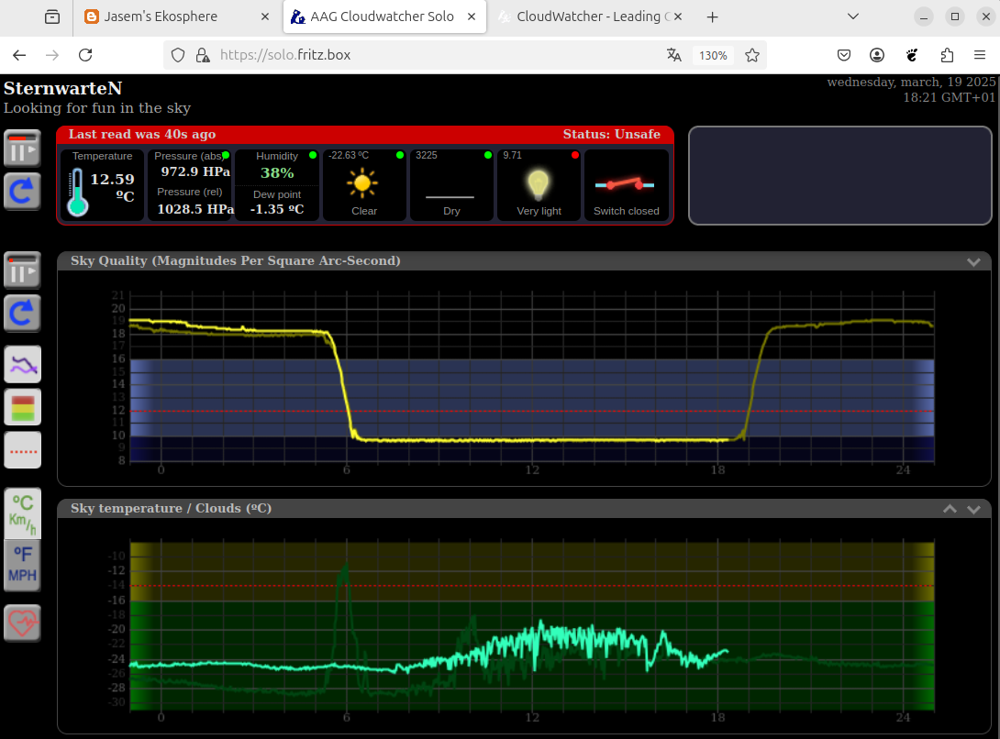
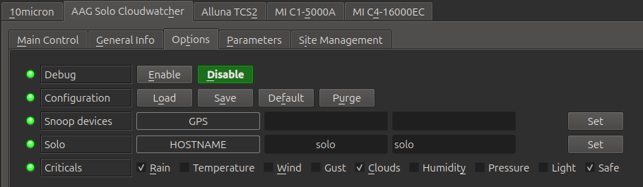
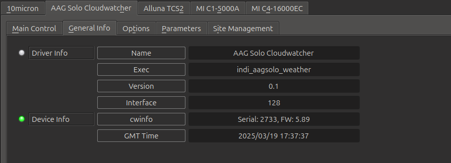

## Features

Driver for AAG Solo Cloudwatcher from Lunatico Astronomia([https://lunaticoastro.com/](https://lunaticoastro.com/))

The Solo is a small rasberry pi based computer which can be directly attached to the CloudWatch weather monitoring sensor. The solo is intented to be always running, so you can have statistics over the last 24 hours. The web page of the Solo gives you basic weather information, like wind and rain, but what is most interesting, it also gives you SQM and it measures Cloud Coverage (Sky Temperatur):

The indi driver indi_aagsolo_weather makes this information available to kstars and is easy to configure.

## Options

Here, you basically set the **hostname** of the solo (factory default is aagsolo). You can use any name you like and also include the domain part. IP address would also work. Next, check all the parameters you consider critical for safety. **Important**: press "Save" next to "Configuration". You need to save each time you change any parameter. Also, if you change anything in the Options tab, you must disconnect and then reconnect in the tab 'Main Control', to make the change effective!

Now, if any of those parameters becomes critical, kstars scheduler will abort operations and shutdown the observatory. If some state becomes 'warning', you will only receive a warning, by nothing else will happen.

Let us now go through the other tabs. The **Main Control** allows you to set a different update period. Since the data is critical for safety, you probably want to set a shorter update period (say 5 seconds), so if it stars rain, ekos will act within 5 seconds. When you check **Override Status**, the driver will always report that weather is safe, even if it is raining. Use with care!

## General Info

## Parameters

At the top is the list of parameters reported by the Solo (Safe is 1 if the solo considers the condition safe, 0 if not). For each parameter, you can define what range is safe (min to max value). Please take care that 'min' must always be smaller than 'max'. Whenever the reported value is outside that range, the parameter is **critical**. To give you a warning when the value is close to critical, you can set a "% for warning" value. If zero, there is no warning. Please note that you specify the percentage of the range (max - min). For example, if the temperature is OK between -30 and +30 C, and the "% for warning" is 30, you have 1an 8 Celsius warning, or 9 C above -30 C and 9 C below +30 C are a warning.

A special case is, when either min or max is zero. In that case, the quantity is assumed to be always postive or negative and there is no warning zone next to zero. This makes sense for wind speed. Wind cannot be negative and zero wind is always safe.