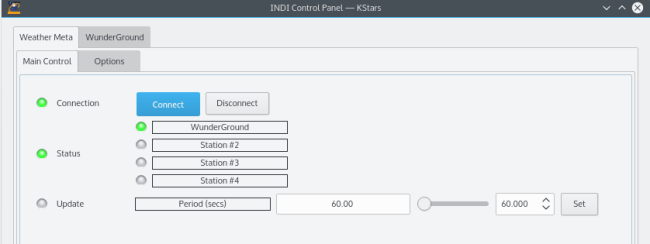
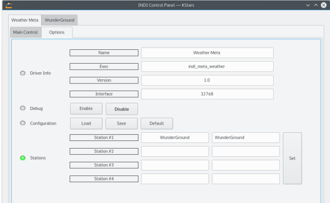

## Features

INDI Weather Meta driver is a virtual driver that aggregates weather status from multiple stations. Since each station driver can represent overall status as either Ok, Warning, or Alert, the meta drivers queries each station status and presents a unified status to the client. Therefore, if one station is Ok, while another station is in Warning state, then the meta driver will report an overall Warning state. The unified driver shall always report the  **worst**  weather station in all the stations.

## Operation

Before you connect, you need to set the names of the weather stations to monitor. You can monitor up to 4 weather stations. After you connect, the driver shall listen to and update the status of each station and update the overall meta state accordingly. An update period property is defined and reflects the fastest updating station being monitored. For example, if Station #1 is updating every 5 minutes, while station #2 is updating every 20 seconds, then the update period is set to 20 seconds. This serves as a hint to the client to check the meta weather status every 20 seconds to ensure proper action is taken by the client in case the status changes to an undesirable state.

